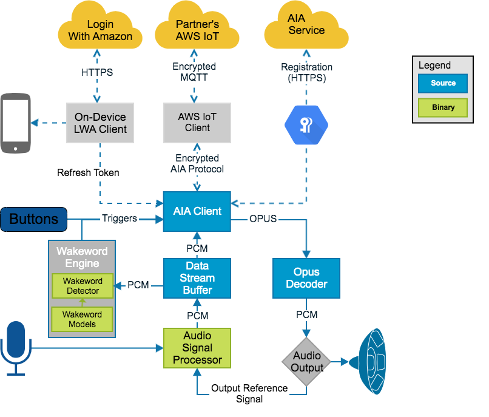

# AIA Client SDK
## Overview
The AIA Client SDK provides a set of C-based libraries that handle all communication with the AIA service.

## Dependencies
### Required Dependencies
#### Language
 The SDK is written to adhere to the ANSI C99 specification. Therefore, your compiler should support C99 at a minimum.

#### Platform
The SDK is written to be platform agnostic with platform specific API’s specified under the `ports` directory. In general, it uses the AWS IoT Device SDK porting layer. To override any specific functionality for a platform, the corresponding files under the `ports` directory can be modified and the project can then subsequently be re-compiled.

#### Build Tools
The SDK uses [CMake](https://cmake.org/) as its build configuration tool. The SDK requires a minimum of version `3.11`.

#### Libraries
##### MbedTLS
The SDK, by default, relies on [MbedTLS](https://github.com/ARMmbed/mbedtls) for functionality related to cryptography and random number generation. Users have the option to point functionalities provided MbedTLS to platform-specific APIs.

##### Unity test framework
[Unity](https://github.com/ThrowTheSwitch/Unity) is a cross-platform test framework and the unit tests in the SDK make use of it, along with a couple of extra modules that come bundled with it.

##### AWS IoT Device SDK for Embedded C
AWS IoT Device SDK for Embedded C provides libraries used to connect to AWS IoT platform and AIA Client SDK relies on the `v4_beta` [branch](https://github.com/aws/aws-iot-device-sdk-embedded-C/tree/v4_beta) of it that brings together AWS IoT Device SDK Embedded C and Amazon FreeRTOS libraries. Libraries SDK heavily relies on are `libiotbase`, `libiotmqt
t`, `libiotserializer` and `libawsiotcommon`.

##### LibCurl
[LibCurl](https://curl.haxx.se/libcurl/) is a client-side, portable file-transfer library; and SDK, by default, relies on it to perform HTTP(s) registration requests.

### Optional Dependencies
#### Libraries
The SDK’s sample app makes full use of Audio I/O off the device platform. It requires [PortAudio - an Open-Source Cross-Platform Audio API](http://www.portaudio.com/) and [libopus 1.3 – Opus Codec](http://opus-codec.org/release/stable/2018/10/18/libopus-1_3.html).  These are enabled by default and will be autodetected if they are installed in a system path or a path you have specified in your CMAKE_PREFIX_PATH.  They can be turned off during the CMake process with the following CMake flags:

# Getting Started
Please refer to the QuickStartGuide to build the SDK with its dependencies and to run a sample demo app on Raspberry Pi platform; and to the PortingGuide to learn more about how to port platform-agnostic functions in the SDK based on your implementation preferences.

For support on FreeRTOS platform, please visit https://github.com/aws-samples/alexa-voice-service-integration-for-aws-iot-freertos-porting-kit.
